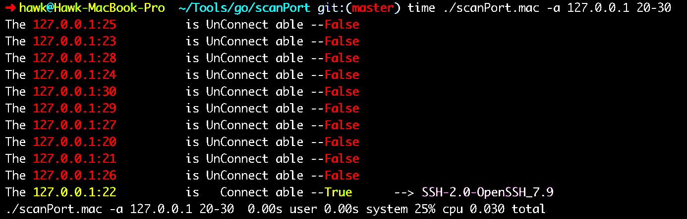

# scanPort  端口探测 

## 1.用途 

> 可以用来简单快速的探测主机对外的端口开放情况
>
> 

## 2. 用法

>  scanPort	[-a]	ip_addr	ip_port_range
>
> `scanPort`   二进制程序名;
>
>  `-a`   可选参数用来选择是否显示所有(开放的与不开放)结果;
>
> `ip_addr`  目标地址仅支持ipv4;
>
> `ip_port_range`  端口范围,支持3种指定方式:
>
> ​								a-b	: 20-25 —> 20,21,22,23,24,25 20到25这5个端口
>
> ​								a,b,c : 22,80,8080 —>22,80,8080 三个端口
>
> ​								a	   : 3306 —>3306 单个端口
>
> * 理论上可以3种语法混合使用，但目前没有做实现。

## 3.原理

> * 简单粗暴
>
> ​      使用Socket 直接向指定地址建立TCP链接。如果没有异常 则认为地址可达，否则认为地址不可达。
>
> ​      对于可达的地址，会设置1s超时来接收数据(如有)，并在输出结果时 打印在行末。
>
> * 使用goroutine并发
>
>   对每一个地址开一个并发，以加快速度。 
